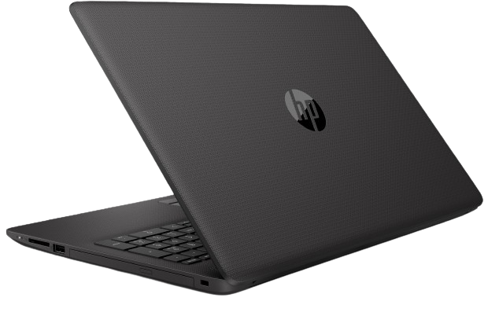

I have always wanted a homelab to experiment and play around with, and until recently I had to get a bit creative.

# My first *server*

My first "server" was an HP 250 G6 laptop, powered by the almighty Intel N4000. Needless to say, it couldn't do much. The abmissal CPU was just one of its limitations: it only had a 250GB m.2 SATA SSD and no other expansion slot.

I decided to put Ubuntu Server 22.04 and CasaOS on it. After a looong install and an equally long reboot, the dashboard loaded! Success!

CPU usage skyrocketed from the start: just ssh'ing into the machine felt sluggish and slow, but then again, it worked!

One merit of this machine was certainly its power consumption. Granted, it didn't have much to power, but with a TDP of 6W, it was basically background noise in the overall energy consumption of the house.

## The "services" I ran on it.

I tried to install Jellyfin to stream movies from it and, as you might expect, it went horribly.

In retrospect, it was rather naive to think that it could somehow run properly, but as we all know, handsight is 20/20.

While it *could* stream (mind you, stream, **not** transcode) files directly to supported clients, doing so would destroy the machine's performance, resulting in several tens of seconds of waiting to log into the web interface.

I've always wanted to break away from greedy Google and switch to a (possibly EU-based) Nextcloud provider, but it was never financially viable. However, now that I have a machine on which I can host it myself, it started to look a lot more feasible.

Given the hardware at hand, it wasn't. NC *sort of* runs. Sometimes. Other times it would just crash the whole thing. I always wondered why, or even how, it managed to reboot the whole system, but I guess we'll just have to live with the doubt.

After a while, my mum needed a PC to do some work. So I decided to install Chrome Os Flex on what had been my server and call it a day. It was a fun experiment.

Chrome OS Flex actually run decently on it, much to my surprise. The more you know. 

Fastforward about a year and we’re installing solar panels: that means free power! And free power means my mom is very likely to accept my beggings for a decent server.

Click here for the story of my first powerful machine that I can run prod services on. 

